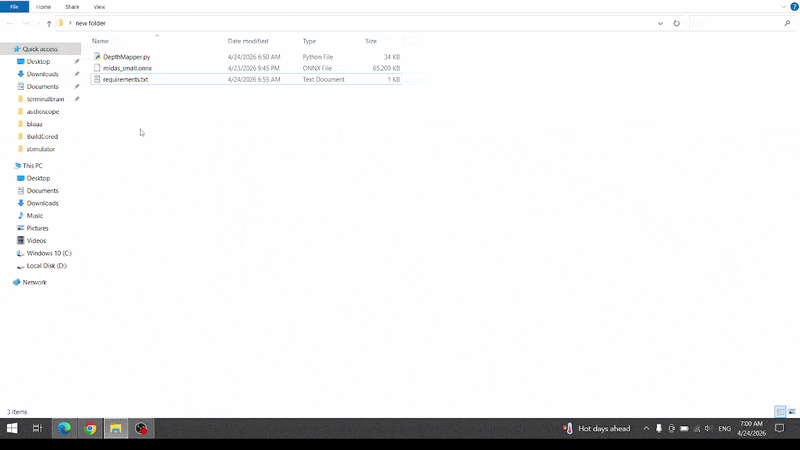

<div align="center">

<br/>

```
██████╗ ███████╗██████╗ ████████╗██╗  ██╗███╗   ███╗ █████╗ ██████╗ ██████╗ ███████╗██████╗
██╔══██╗██╔════╝██╔══██╗╚══██╔══╝██║  ██║████╗ ████║██╔══██╗██╔══██╗██╔══██╗██╔════╝██╔══██╗
██║  ██║█████╗  ██████╔╝   ██║   ███████║██╔████╔██║███████║██████╔╝██████╔╝█████╗  ██████╔╝
██║  ██║██╔══╝  ██╔═══╝    ██║   ██╔══██║██║╚██╔╝██║██╔══██║██╔═══╝ ██╔═══╝ ██╔══╝  ██╔══██╗
██████╔╝███████╗██║        ██║   ██║  ██║██║ ╚═╝ ██║██║  ██║██║     ██║     ███████╗██║  ██║
╚═════╝ ╚══════╝╚═╝        ╚═╝   ╚═╝  ╚═╝╚═╝     ╚═╝╚═╝  ╚═╝╚═╝     ╚═╝     ╚══════╝╚═╝  ╚═╝
```

### *Monocular Depth Estimation — Day 18 · BUILDCORED ORCAS*

<br/>



<br/>


<br/>

> **Your webcam. One lens. Full depth perception.**
> DepthMapper turns a regular webcam into a software-equivalent of a LiDAR unit —
> estimating depth for every pixel in real time using the MiDaS neural network,
> no special hardware required.

<br/>

</div>

---

## ✦ What This Is

Real depth sensors — like the ones in self-driving cars, iPhone LiDAR, or industrial robots — measure distance by shooting photons at the world and timing how long they bounce back. That's Time-of-Flight. That's LiDAR. That's structured light.

DepthMapper does something wilder: it looks at a single 2D RGB frame from your webcam and **predicts the distance of every pixel** using a neural network trained on millions of real depth scans. No infrared. No laser. No stereo rig. Just math and a lot of learned intuition about how the world looks.

This is called **monocular depth estimation**, and MiDaS is one of the best open-source models for it.

The output: a live colorized **depth heatmap** where warm colors (yellow/orange) are close and dark colors (purple/black) are far — updated in real time as you move in front of your camera.

---

## ✦ What It Does

| Feature | Detail |
|---|---|
| 🎥 **Live webcam depth heatmap** | MAGMA colormap, normalized per-frame, updates ~2–5 FPS on CPU |
| 📊 **Live matplotlib dashboard** | Webcam feed + depth heatmap + histogram + live stats side by side |
| 📈 **Real-time depth histogram** | Shows how depth is distributed across the current scene |
| 📡 **Live stats panel** | FPS, mean depth, nearest %, farthest %, frame count |
| 💾 **Point cloud CSV export** | Press SPACE → exports `x, y, depth_norm, depth_mm` for every 4th pixel |
| 🔁 **3-tier backend fallback** | PyTorch MiDaS → ONNX Runtime → Gaussian fallback, auto-detected |
| 🔌 **Hardware bridge panel** | Shows exactly how to swap in a RealSense D435 or LiDAR in v2.0 |
| 🧵 **Threaded webcam capture** | Background thread keeps frames fresh — no blocking, no lag |

---

## ✦ Hardware Concept

This project is the **software equivalent of a physical depth sensor**:

| Real Hardware | What It Does | DepthMapper Equivalent |
|---|---|---|
| Intel RealSense D435 | Structured light depth camera | `MiDaSBackend.estimate()` |
| iPhone LiDAR Scanner | dToF depth sensing | `ONNXBackend.estimate()` |
| Velodyne VLP-16 | Spinning laser LiDAR | `export_point_cloud()` CSV |
| SICK LMS | Time-of-flight rangefinder | Center-region depth reading |

The abstraction is intentional. In v2.0, you replace `backend.estimate(frame)` with a RealSense SDK call and the **entire pipeline stays identical** — colorizer, histogram, CSV exporter, dashboard. That's the point.

---

## ✦ Demo

> Move your hand closer and further from the camera and watch the heatmap shift in real time.
> The histogram updates live — you can see the depth distribution change as the scene changes.

---

## ✦ Installation

**Option A — PyTorch (best quality, ~80MB download on first run):**
```bash
pip install opencv-python numpy matplotlib torch torchvision
python DepthMapper.py
```

**Option B — ONNX Runtime (no PyTorch needed, ~25MB download on first run):**
```bash
pip install opencv-python numpy matplotlib onnxruntime
python DepthMapper.py
```

The script auto-detects which backend is available and picks the best one. No config needed.

---

## ✦ Controls

| Key | Action |
|---|---|
| `SPACE` | Export current frame as `point_cloud.csv` |
| `H` | Toggle the live depth histogram |
| `Q` / `ESC` | Quit |

---

## ✦ Output: Point Cloud CSV

Pressing SPACE exports a file like this:

```
x,y,depth_norm,depth_mm
0,0,0.8731,6984
4,0,0.8612,6889
8,0,0.7943,6354
...
```

- `x`, `y` — pixel coordinates (every 4th pixel, ~19,200 points at 640×480)
- `depth_norm` — normalized depth [0.0 = near, 1.0 = far]
- `depth_mm` — rough metric estimate (mapped 0–8000mm as demo scale)

This is the same format used in real LiDAR pipelines. In a production system you'd add RGB columns and calibrate the metric scale against a known reference object.

---

## ✦ Architecture

```
Webcam (threaded)
      │
      ▼
  WebcamCapture                  ← background thread, no blocking
      │
      ▼
  DepthBackend.estimate()        ← abstract interface
      ├── MiDaSBackend           ← PyTorch, best quality
      ├── ONNXBackend            ← onnxruntime, no torch needed
      └── GaussianFallback       ← edge-based proxy, zero dependencies
      │
      ▼
  normalize → colorize (MAGMA)
      │
      ▼
  DepthDashboard.update()
      ├── Webcam panel
      ├── Depth heatmap
      ├── Live histogram
      ├── Stats cards (FPS, mean depth, near%, far%)
      └── Hardware bridge panel
```

The `DepthBackend` abstract class is the key design decision — any new backend (RealSense, Azure Kinect, custom ToF sensor) slots in by implementing one method: `estimate(bgr_frame) → float32 depth map`.

---

## ✦ Common Fixes

**Depth map is all one color**
→ Normalization wasn't applied. Already fixed — `normalize_depth()` stretches values to 0–255 before colorizing.

**torch download is huge / slow**
→ The script uses `MiDaS_small` (~80MB), not the full model. Or skip torch entirely and use ONNX Runtime instead (~25MB).

**torch.hub fails / no internet**
→ ONNX Runtime fallback activates automatically. No action needed.

**Slow FPS on CPU**
→ 2–5 FPS is expected for MiDaS-small on CPU. This is normal. On Apple M-series chips it uses MPS (Metal GPU) and runs noticeably faster.

**CSV is empty or wrong shape**
→ Fixed — the vectorized `np.mgrid` exporter correctly maps pixel coordinates to depth values.

**Webcam not found**
→ Script tries index 0 then 1. Check that your camera isn't in use by another app.

---

## ✦ v2.0 Hardware Swap

When you're ready to go from software simulation to real hardware, the swap is one function:

```python
# Replace this:
depth_map = backend.estimate(frame)

# With this (Intel RealSense D435):
import pyrealsense2 as rs
pipe = rs.pipeline()
pipe.start()
frames = pipe.wait_for_frames()
depth_frame = frames.get_depth_frame()
depth_map = np.asarray(depth_frame.get_data(), dtype=np.float32)
```

Everything else — the dashboard, histogram, CSV exporter, colorizer — stays exactly the same.

---

## ✦ Tech Stack

- **OpenCV** — webcam capture, colormap, image blending
- **NumPy** — depth map math, normalization, point cloud generation
- **Matplotlib** — live dashboard, histogram, stats panels
- **MiDaS** (intel-isl) — monocular depth estimation neural network
- **PyTorch** or **ONNX Runtime** — inference backend (auto-selected)

---

## ✦ Project Structure

```
DepthMapper/
├── DepthMapper.py       # everything — backend, dashboard, exporter, main loop
├── requirements.txt     # pip dependencies
├── point_cloud.csv      # sample export (19,200 points)
├── demo.gif             # screen recording
└── README.md
```

---

<div align="center">

<br/>

*Built during Day 18 of BUILDCORED ORCAS*
*Monocular depth → point cloud → hardware-ready pipeline*

<br/>


<br/>

</div>
